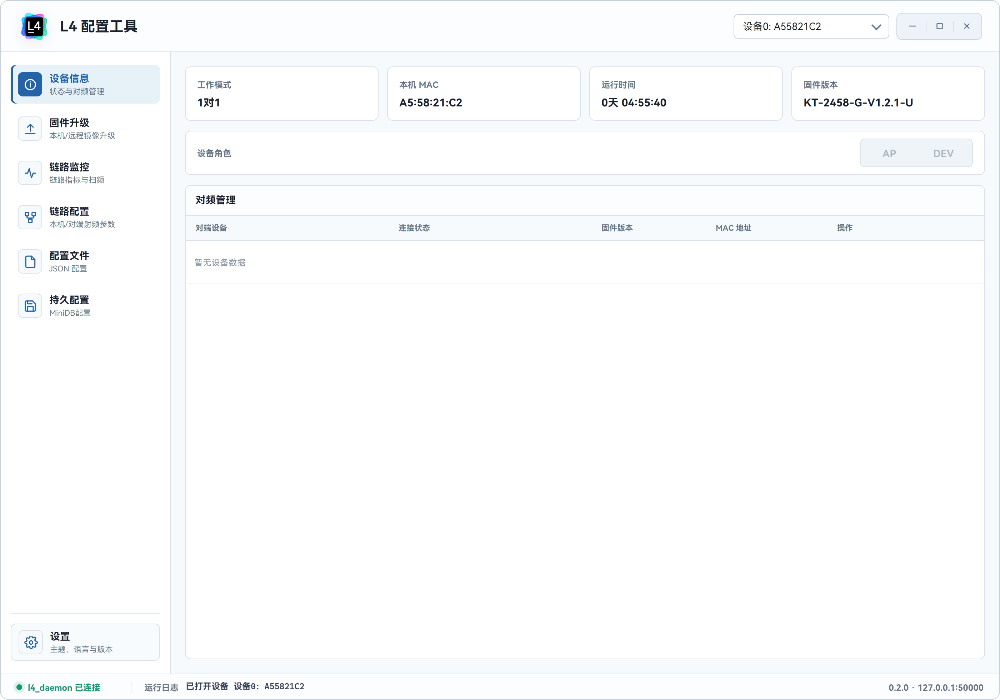
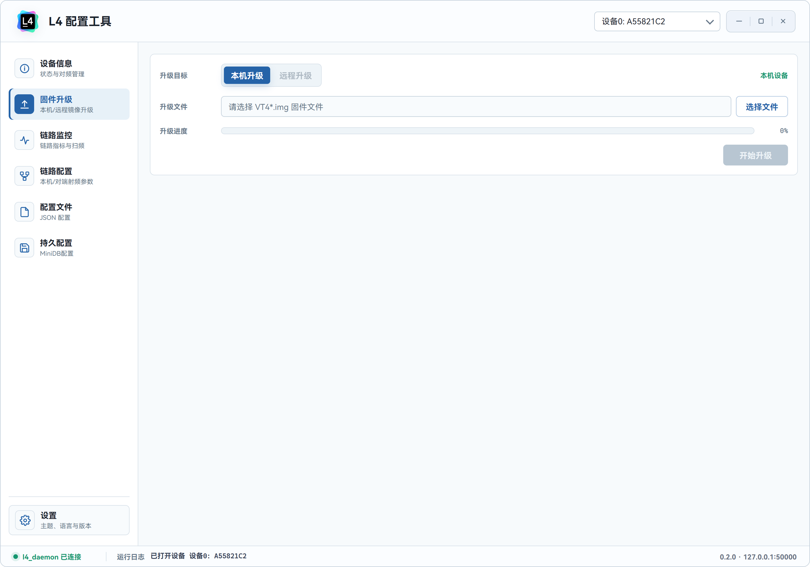
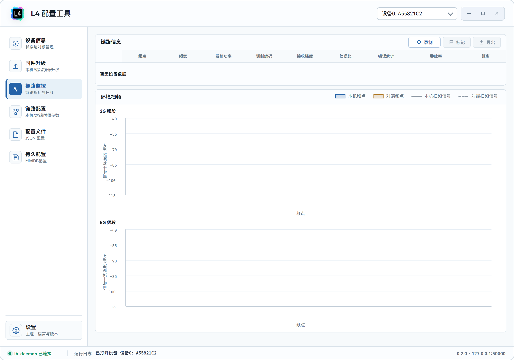
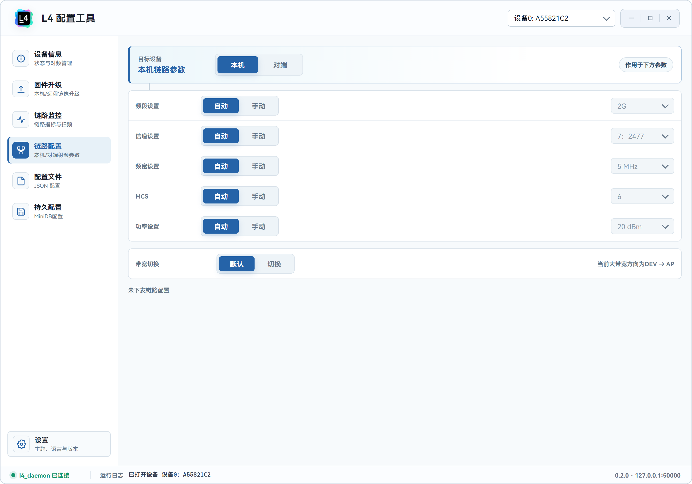
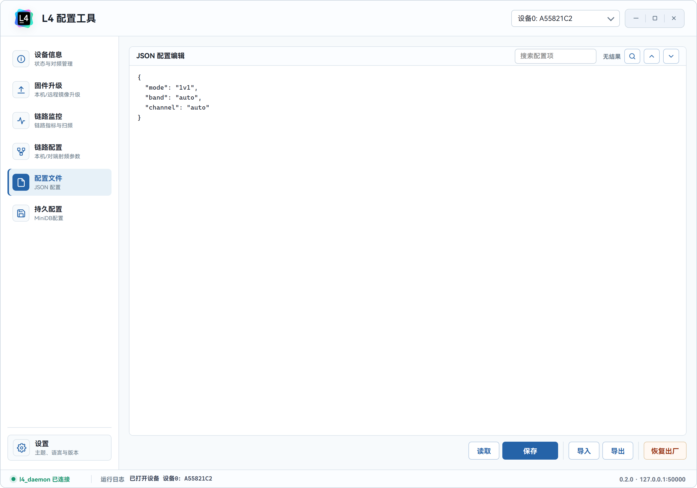
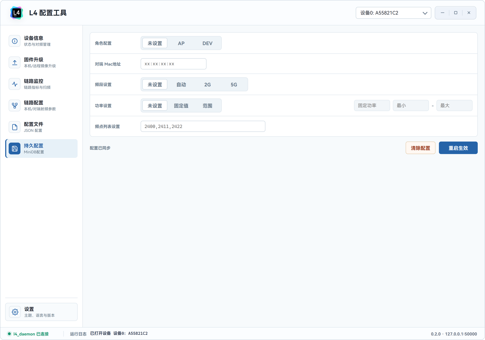
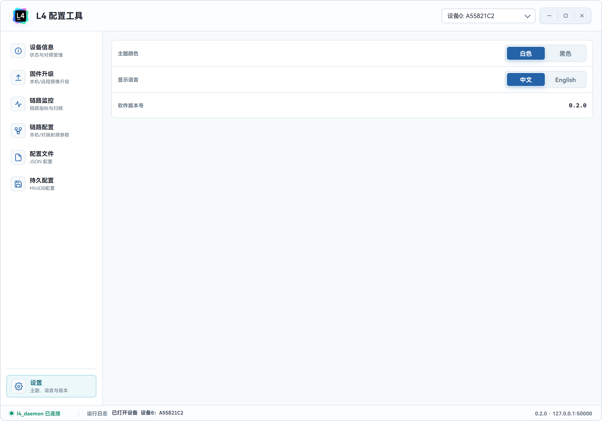

# L4 配置工具软件使用手册

本文面向 L4 配置工具的日常使用人员，说明软件启动、设备连接、状态查看、链路配置、固件升级和配置维护等常用操作。界面截图以实际运行窗口为准，设备在线状态、版本号、MAC 地址和日志内容会随现场设备变化。

## 1. 运行前准备

使用前请确认：

- 已将软件发布包完整解压，工具目录中包含 `L4_Config_Tool_Web.exe`、`l4_daemon.exe`、`l4_ota_upgrade.exe` 以及相关 DLL。
- L4 设备已通过 USB/串口等方式连接到电脑，并保持稳定供电。
- 需要执行固件升级或写配置时，现场设备处于可维护状态，避免业务链路正在使用。

启动软件后，工具会自动连接本机 `l4_daemon`，并扫描可用 L4 设备。窗口右上角的设备下拉框用于选择当前操作设备；底部状态栏显示 daemon 连接状态、最新运行日志、软件版本和连接地址。

## 2. 启动与设备连接

1. 双击运行 `L4_Config_Tool_Web.exe`。
2. 等待底部状态栏显示 `l4_daemon 已连接`。
3. 在右上角设备下拉框中选择需要操作的设备。
4. 如果列表中没有设备，请检查设备连接、驱动、供电和 daemon 状态。

## 3. 设备信息

`设备信息` 页面用于查看当前设备概况和管理对频。

主要信息包括：

- `工作模式`：显示当前链路工作模式，例如 1 对 1、1 对多等。
- `本机 MAC`：当前打开设备的 MAC 地址。
- `运行时间`：设备本次启动后的运行时长。
- `固件版本`：设备当前固件版本。
- `设备角色`：显示 AP 或 DEV 角色，角色由设备状态决定。

`对频管理` 表格按 slot 展示对端设备状态。常用操作：

- `查询`：读取当前 slot 的对端 MAC。
- `设置`：将输入框中的 MAC 写入当前 slot。
- `对频`：启动对频流程。
- `停止`：在对频中止当前对频流程。

注意：设置 MAC 和启动对频会改变设备状态，请确认设备和对端设备处于可维护状态后再执行。

## 4. 固件升级

`固件升级` 页面用于执行本机或远程固件升级。

操作步骤：

1. 在 `升级目标` 中选择 `本机升级` 或 `远程升级`。
2. 点击 `选择文件`，选择符合要求的 `VT4*.img` 固件文件。
3. 确认文件名显示正确后，点击 `开始升级`。
4. 在确认弹窗中核对升级提示，再点击确认开始。
5. 等待进度条完成，期间不要断电、拔线或关闭工具。

重要注意事项：

- 远程升级要求当前设备已完成对频，并且存在可升级的远程 slot。
- 升级过程中请保持设备供电稳定。
- 升级成功后，工具会执行后续恢复配置文件出厂设置和重启设备流程。
- 如果升级失败，请先保留运行日志，再检查固件文件、设备连接和供电状态。

## 5. 链路监控

`链路监控` 页面用于查看链路指标和环境扫频。

链路信息表格显示本机和对端的关键指标：

- 频点、频宽、发射功率、MCS。
- RSSI、SNR、错误统计、吞吐率、距离。

环境扫频图用于观察 2G 和 5G 频段的干扰情况：

- 本机频点和对端频点以竖向标记显示。
- 本机扫频信号和对端扫频信号以不同颜色折线显示。
- 曲线越靠近高干扰区域，说明该频段环境越差，选频时应尽量避开。

链路数据记录：

- 点击 `录制` 开始记录当前链路指标。
- 录制过程中可点击 `标记` 添加现场事件标记。
- 点击 `导出` 将记录保存为 CSV 文件。

注意：录制只记录软件侧链路数据，不会改变设备配置。

## 6. 链路配置

`链路配置` 页面用于调整本机或对端射频参数。

页面顶部的 `目标设备` 用于选择配置作用对象：

- `本机`：配置当前打开设备。
- `对端`：配置当前链路中的对端设备，需要链路和远程调用能力可用。

可配置项包括：

- `频段设置`：自动或手动选择 2G/5G。
- `信道设置`：自动或手动选择信道。
- `频宽设置`：自动或手动选择 1.25 MHz 到 40 MHz。
- `MCS`：自动或手动选择调制编码。
- `功率设置`：自动或手动选择发射功率。
- `带宽切换`：在默认和切换方向之间切换大带宽方向。

使用建议：

- 不确定现场频谱情况时，先在 `链路监控` 查看环境扫频，再调整频段和信道。
- 选择 `手动` 后，对应下拉框才会启用。
- 参数变化后请观察页面底部的配置状态，例如 `正在下发链路配置`、`链路配置已下发` 或失败提示。
- 对端配置依赖对频和远程链路状态；如果失败，请先确认设备信息页中的连接状态。

## 7. 配置文件

`配置文件` 页面用于读取、编辑、导入、导出设备 JSON 配置。

常用操作：

- `读取`：从设备读取当前 JSON 配置并显示在编辑区。
- `保存`：将编辑区中的 JSON 写入设备，写入前会校验 JSON 格式并弹出确认。
- `导入`：从本地文件导入 JSON 到编辑区。
- `导出`：将编辑区中的 JSON 保存到本地文件。
- `恢复出厂`：将设备配置恢复为出厂默认值。
- 搜索框：在 JSON 内容中查找配置项，可使用上一个/下一个按钮跳转。

注意：

- 点击 `保存` 会覆盖设备当前配置，请先确认 JSON 内容正确。
- `恢复出厂` 属于高风险操作，会覆盖当前设备配置，执行前请先导出备份。
- 导入文件只改变编辑区内容；写入设备需要再点击 `保存` 并确认。

## 8. 持久配置

`持久配置` 页面用于管理设备 MiniDB 中的持久化参数。

可配置项包括：

- `角色配置`：未设置、AP、DEV。
- `对端 Mac地址`：写入对端 MAC。
- `频段设置`：未设置、自动、2G、5G。
- `功率设置`：未设置、固定值、范围。
- `频点列表设置`：输入频点列表，例如 `2400,2411,2422`。

写入规则：

- 分段按钮类配置在点击后写入。
- 文本或数字输入项通常在按 Enter 或输入框失焦后写入。
- 页面状态会显示 `配置已同步`、`配置已修改`、`正在写入配置` 或 `等待重启生效`。

底部操作：

- `清除配置`：清除设备 MiniDB 持久配置，执行前会弹出确认。
- `重启生效`：重启设备使持久配置生效，执行后设备会短暂断开连接。

注意：清除配置和重启设备都会影响现场设备状态，请确认业务允许后再执行。

## 9. 设置

`设置` 页面用于调整软件显示偏好并查看软件版本号。

可设置项：

- `主题颜色`：切换白色或黑色主题。
- `显示语言`：切换中文或 English。
- `软件版本号`：显示当前软件版本，实际版本以此处为准。

主题和语言设置会保存到本机，下次打开软件时自动恢复。

## 10. 运行状态与日志

窗口底部状态栏用于判断软件当前状态：

- 左侧圆点和文字表示 `l4_daemon` 连接状态。
- 中间 `运行日志` 显示最近一次操作结果，例如设备打开、配置读取、持久配置已读取等。
- 右侧显示软件版本和 daemon 地址。

如果操作失败，请优先查看底部运行日志，再检查设备连接、daemon 状态、对频状态和输入参数。

## 11. 常见问题

### 设备下拉框没有设备

请检查设备是否正确连接、供电是否稳定、驱动是否正常，并确认底部状态栏不是 `l4_daemon 未连接`。

### 对端升级不可用

远程升级需要对端设备已对频并可通过当前链路访问。请先在 `设备信息` 页确认 slot 连接状态，再尝试远程升级。

### 链路配置下发失败

请确认当前设备在线；如果配置目标是对端，请确认对端已连接。必要时切回 `链路监控` 查看链路是否就绪。

### JSON 保存失败

请先确认编辑区内容是合法 JSON。保存前建议先导出备份，避免覆盖有效配置。

### 持久配置写入后没有立即生效

部分持久化参数需要设备重启后生效。请根据页面状态提示点击 `重启生效`，并等待设备重新上线。

## 12. 操作安全建议

- 固件升级、恢复出厂、清除持久配置、重启设备、写入 JSON 配置都属于会改变设备状态的操作。
- 执行高风险操作前，建议先导出当前配置或记录现场参数。
- 升级期间不要断电、拔线或关闭软件。
- 现场调参时建议一次只改一类参数，便于定位效果和回滚。
